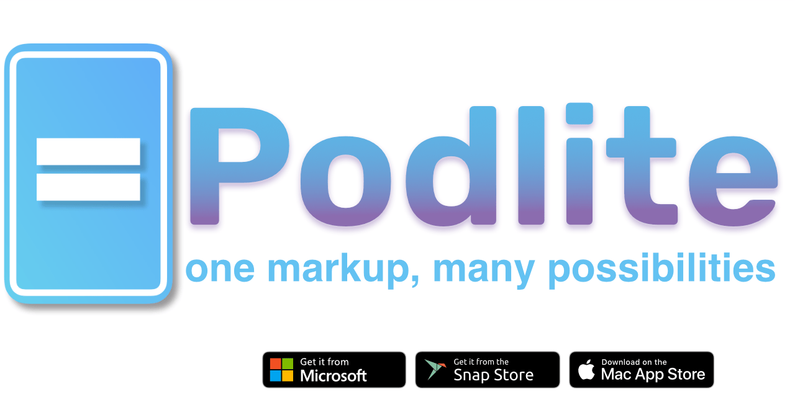
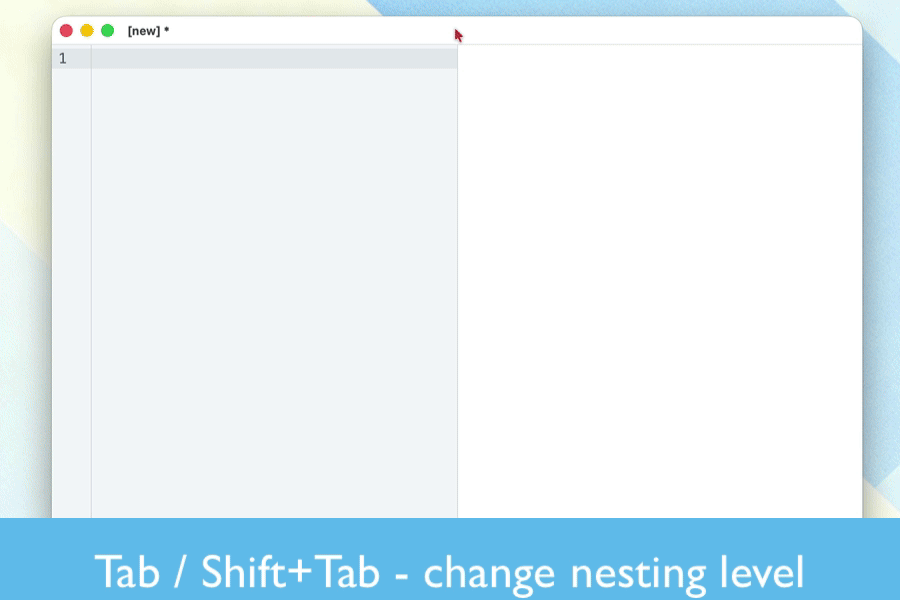
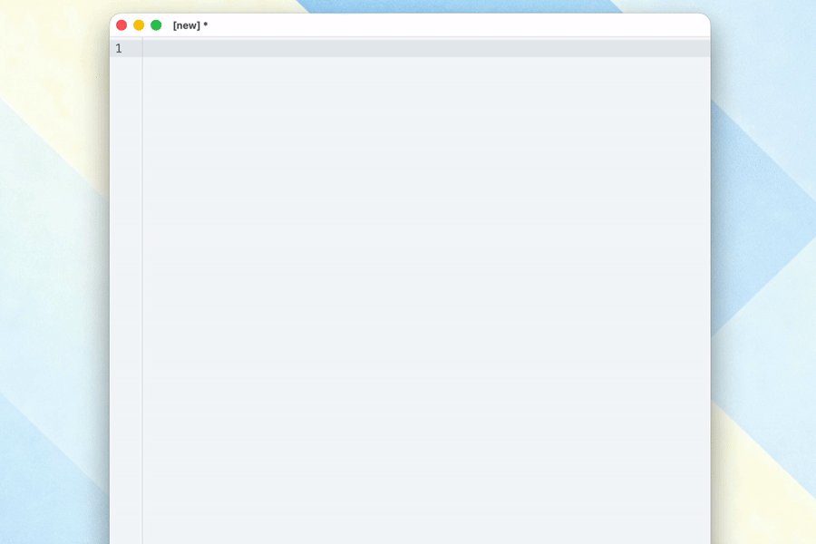
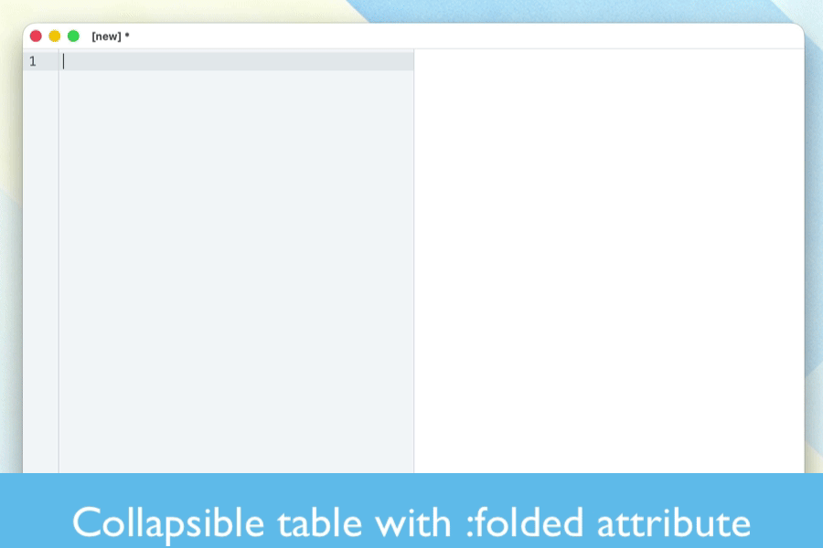
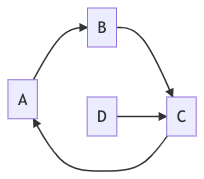
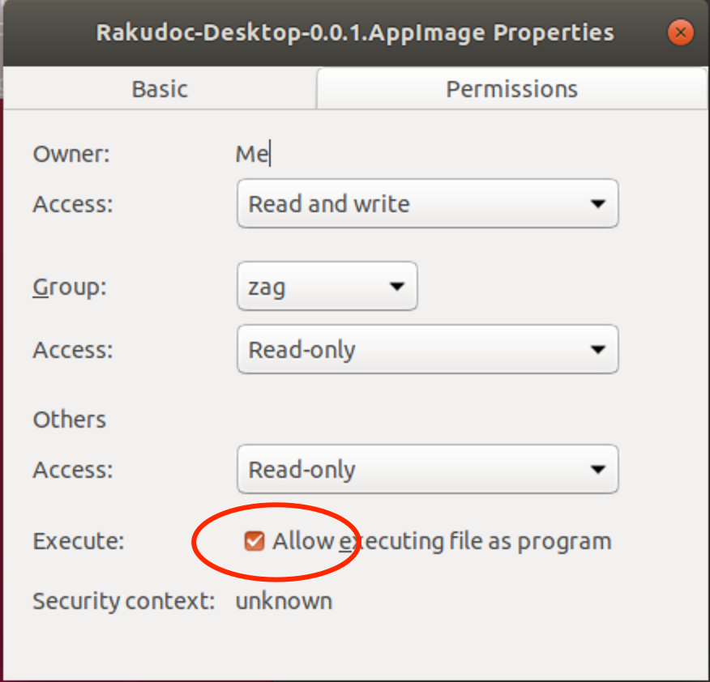

<p align="center">
  
</p>
<h1 align="center">Podlite Desktop</h1>
<p align="center">block-based markup editor with live preview</p>

<div align="center">

A block-based markup editor for [Podlite](https://podlite.org) with live preview. Available on Windows, Linux and macOS.

[](https://github.com/zag/podlite-desktop/releases/latest)
[](LICENSE)
[](https://apps.apple.com/us/app/podlite/id1526511053)
[](https://www.microsoft.com/store/apps/9NVNT9SNQJM8)
[](https://snapcraft.io/podlite)

</div>

## Get Podlite

Download the [latest release](https://github.com/podlite/podlite-desktop/releases/latest):

### [Download Podlite](https://github.com/podlite/podlite-desktop/releases/latest)

Also available from [Mac App Store](https://apps.apple.com/us/app/podlite/id1526511053), [Microsoft Store](https://www.microsoft.com/store/apps/9NVNT9SNQJM8) and [Snap Store](https://snapcraft.io/podlite).

## Smart Lists

Press Enter to continue a list. Checkboxes and numbered markers carry over to the next item.


Tab increases nesting level. Shift+Tab decreases it. Works with plain lists, numbered lists and task lists.



## Code Folding

Collapse `=begin`/`=end` blocks and `=head` sections to navigate large documents. Fold state is preserved between sessions.



## Collapsible Blocks

Add `:folded` to any block to make it collapsible in preview. Use `:!folded` for expanded by default.



## Features

### Editor
- smart list continuation on Enter with preserved type prefix (`[ ]`, `#`)
- Tab / Shift+Tab to change nesting level
- code folding for `=begin`/`=end` and `=head` sections (Ctrl+Shift+\[ / Ctrl+Shift+\])
- near-zero input latency on large documents
- syntax highlighting for Podlite markup
- text search (Cmd+F / Ctrl+F)

### Preview
- live preview while you type
- split view (Cmd+. / Ctrl+.)
- full preview (Cmd+\\ / Ctrl+\\)
- collapsible blocks with `:folded` attribute
- export to HTML and PDF

### Workspace
- session restore: cursor position, scroll, folds, view mode
- per-file view mode persistence (editor / split / preview)
- auto-reload when file changes on disk
- import from Markdown

### Blocks and Extensions
- `=markdown` — GitHub Flavored Markdown
- `=Mermaid` — diagrams and charts
- `=formula` — math formulas
- `=picture` — images and video
- `=toc` — table of contents
- `=table` — tables with `:folded` support

## Podlite Blocks

### `=markdown`

Switch to GitHub Flavored Markdown inside a Podlite document:

```
=begin markdown

# Heading

*Write* the docs with the markup you __love__!

* item 1
* item 2

=end markdown
```

[Try in pod6.in](https://pod6.in/#p=%3Dbegin+markdown%0A%0A++%23+Cases%0A++%0A++*Write*+the+documentation+with+the+markup+you+__love__%21%0A%0A++*+item1+%0A++*+item2%0A++%09+*+%7E%7Esub+item1%7E%7E%0A+++++*+sub+item2%0A%0A%3Dend+markdown)

### `=Mermaid`

Render diagrams, flowcharts and sequence diagrams:

```
=begin Mermaid
graph LR
    A-->B
    B-->C
    C-->A
    D-->C
=end Mermaid
```



[Try in pod6.in](https://pod6.in/#p=%3Dbegin+Mermaid%0Agraph+LR%0A++++++++A-->B%0A++++++++B-->C%0A++++++++C-->A%0A++++++++D-->C%0A%3Dend+Mermaid) — [Mermaid syntax reference](https://mermaid.js.org/intro/)

### `=toc`

Generate a table of contents from headings:

```
=for toc :title('Table of contents')
head1, head2, head3
```

### `=picture`

Embed images or video:

```
=picture photo.png
A caption for the image
```

## Documentation

- [Podlite markup language](https://podlite.org)
- [Specification](https://podlite.org/specification)
- [Quick tour](https://podlite.org/quick-tour)
- [Online editor: pod6.in](https://pod6.in/)

## Contributing

This is an open source project. Feel free to fork and contribute.

Please submit pull requests against the develop branch to keep documentation in sync with the latest release.

## Linux Note



## Links

<div align="center">
<table border=0><tr><td valign=top><div align="center">

##### specification

</div>

- [Source](https://github.com/podlite/podlite-specs)
- [HTML](https://podlite.org/specification)
- [Discussions](https://github.com/podlite/podlite-specs/discussions)

<div align="center">

##### implementation

</div>

- [Source](https://github.com/podlite/podlite)
- [Changelog](https://github.com/podlite/podlite/releases)
- [Issues](https://github.com/podlite/podlite/issues)

</td><td valign=top><div align="center">

##### publishing

</div>

- [Podlite-web](https://github.com/podlite/podlite-web)
- [How-to article](https://zahatski.com/2022/8/23/1/start-you-own-blog-site-with-podlite-for-web)
- [Changelog](https://github.com/podlite/podlite-web/releases)

</td><td valign=top><div align="center">

##### desktop editor

</div>

- [Releases](https://github.com/podlite/podlite-desktop/releases)
- [Issues](https://github.com/podlite/podlite-desktop/issues)
- Stores: [Mac](https://apps.apple.com/us/app/podlite/id1526511053) · [Windows](https://www.microsoft.com/store/apps/9NVNT9SNQJM8) · [Linux](https://snapcraft.io/podlite)

</td><td valign=top><div align="center">

##### resources

</div>

- [podlite.org](https://podlite.org)
- [pod6.in](https://pod6.in/)
- [github.com/podlite](https://github.com/podlite/)
- [Funding](https://opencollective.com/podlite)

</td></tr></table>
</div>

<p align="center">
  <a href="https://podlite.org"></a>
</p>

## Author

Copyright (c) 2020–2026 Alexandr Zahatski

## License

Released under a MIT License.
