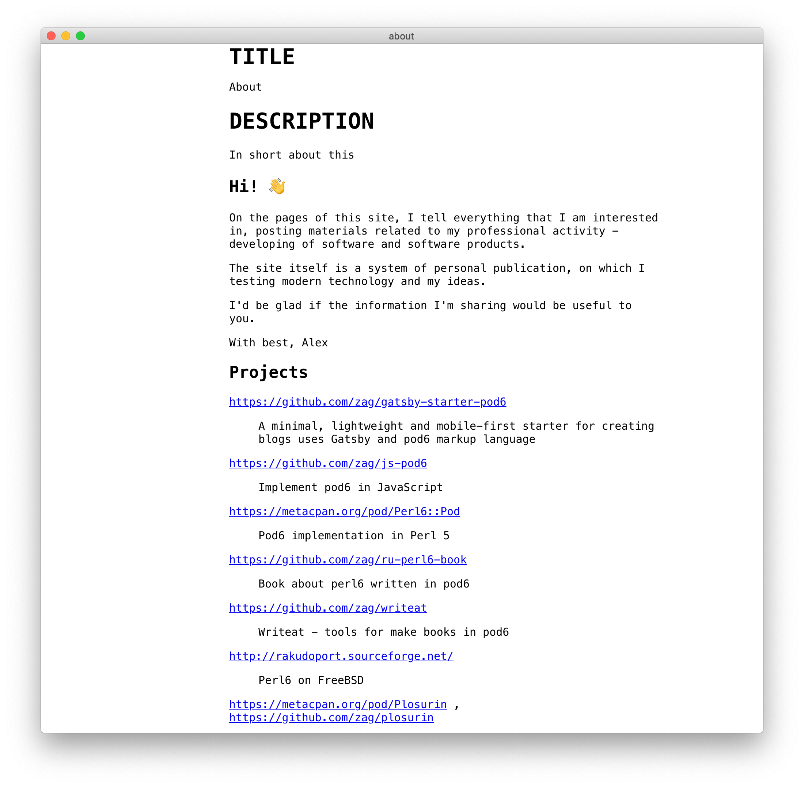

 <h1 align="center">

  
  Rakudoc Desktop
 
 
</h1>
<h4 align="center">The editor of pod6 files for Windows, Linux and Mac.</h4>

## Screenshots

## Get Rakudoc Desktop

Download the [latest release](https://github.com/zag/rakudoc-desktop/releases/latest) of Rakudoc Desktop here:

### [✨ Download Rakudoc Desktop ✨](https://github.com/zag/rakudoc-desktop/releases/latest)

## Features

* Write in pod6 markup language 
* Preview text elements (such as headers, images, math, embedded videos, todo lists...) while you type
* Preview mode cmd-/ ( ctrl-/)
* And more features to come...

## pod6 extensions
### `=Image` - use images in posts

Example:

`=Image gatsby-astronaut.png
`

## Documentation
* [Pod6 - An easy-to-use markup language for documenting Raku modules and programs](https://docs.raku.org/language/pod)
* Specification of pod6: [Synopsis 26](https://github.com/perl6/specs/blob/master/S26-documentation.pod)
* [Create a blog with pod6](https://zahatski.com/2020/5/28/1/create-a-blog-with-pod6)
* Pod6 online editor: [Pod6 to HTML online](https://pod6.in/)

## Contributing

This is an open source program. Feel free to fork and contribute.

In order to keep the match between this documentation and the last release, please contribute and pull requests on the dedicated develop branch.

## AUTHOR

Copyright (c) 2020 Aliaksandr Zahatski

## License

Released under a MIT License.