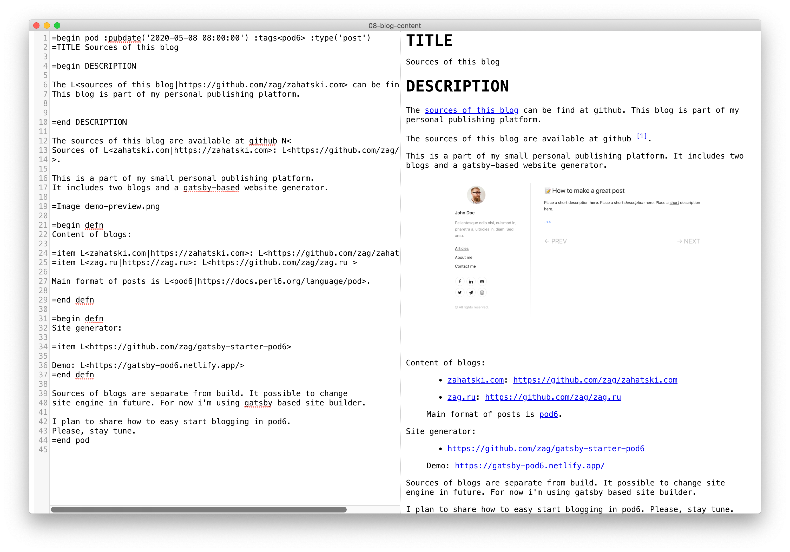
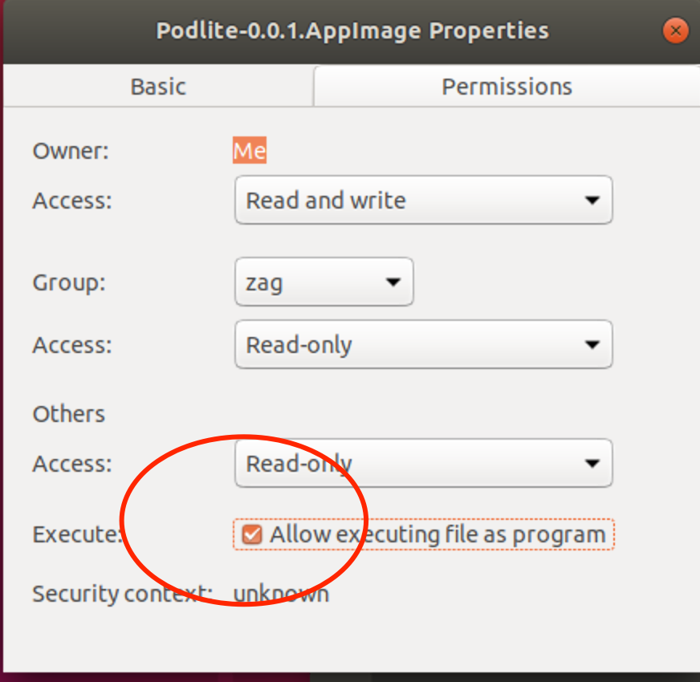

 <h1 align="center">

<br/> 
  Podlite for Desktop
<br/>
<br/>
</h1>

<div align="center">

The viewer and editor of [Podlite](https://podlite.org) files for Windows, Linux and Mac.

</div>

## Screenshots





## Get Podlite

Download the [latest release](https://github.com/podlite/podlite-desktop/releases/latest) of Podlite editor here:

### [✨ Download Podlite ✨](https://github.com/podlite/podlite-desktop/releases/latest)

## Features

- Write in Podlite markup language
- Preview elements (such as headers, images, math, embedded videos, todo lists...) while you type
- Preview mode cmd-/ ( win-/ )
- export to html and pdf
- import from markdown
- make diagrams via `=Mermaid` block
- write in markdown via `=markdown` block
- And more features to come...

## Podlite blocks and extensions

### `=markdown` - markdown block

You can switch to write GitHub Flavored Markdown ([GFM](https://github.github.com/gfm/)).

Examples:

```
=begin markdown

  # Cases

  *Write* the documentation with the markup you __love__!

  * item1
  * item2
  	 * ~~sub item1~~
     * sub item2

=end markdown
```

[Open this example in pod6.in](https://pod6.in/#p=%3Dbegin+markdown%0A%0A++%23+Cases%0A++%0A++*Write*+the+documentation+with+the+markup+you+__love__%21%0A%0A++*+item1+%0A++*+item2%0A++%09+*+%7E%7Esub+item1%7E%7E%0A+++++*+sub+item2%0A%0A%3Den d+markdown)

### `=useReact`, `=React` - additional blocks to support the "Podlite for Web" package

For more information, please read the following article:
[Start your own blog/website with Podlite for Web](https://zahatski.com/2022/8/23/1/start-you-own-blog-site-with-podlite-for-web)

### `=toc` - add Table of contents

Examples:

```
=toc head1, head2, head3
```

```
=for toc :title('Table of contents')
head1, head2, head3
```

### `=picture` - use images or video in posts

Example:

```
=picture gatsby-astronaut.png
```

```
=picture some-video.mp4
```

```
=picture some-video.mp4
This is a caption!
```

### `=Mermaid` - use diagrams

To render beautiful graphs, sequence and Gantt diagrams and flowcharts, one can use the `=Mermaid` blocks.

```
=begin Mermaid
graph LR
        A-->B
        B-->C
        C-->A
        D-->C
=end Mermaid
```


[Open this example in pod6.in](https://pod6.in/#p=%3Dbegin+Mermaid%0Agraph+LR%0A++++++++A-->B%0A++++++++B-->C%0A++++++++C-->A%0A++++++++D-->C%0A%3Dend+Mermaid)

#### Flowchart

```
=Mermaid
graph LR
    A[Square Rect] -- Link text --> B((Circle))
    A --> C(Round Rect)
    B --> D{Rhombus}
    C --> D
```


[Open this example in pod6.in](https://pod6.in/#p=%3DMermaid%0Agraph+LR%0A++++A%5BSquare+Rect%5D+--+Link+text+-->+B%28%28Circle%29%29%0A++++A+-->+C%28Round+Rect%29%0A++++B+-->+D%7BRhombus%7D%0A++++C+-->+D)

```
=Mermaid
graph TD
   A(Coffee machine <br>not working) --> B{Machine has power?}
   B -->|No| H(Plug in and turn on)
   B -->|Yes| C{Out of beans or water?} -->|Yes| G(Refill beans and water)
   C -->|No| D{Filter warning?} -->|Yes| I(Replace or clean filter)
   D -->|No| F(Send for repair)
```


[Open this example in pod6.in](https://pod6.in/#p=%3DMermaid%0Agraph+TD%0A+++A%28Coffee+machine+<br>not+working%29+-->+B%7BMachine+has+power%3F%7D%0A+++B+-->%7CNo%7C+H%28Plug+in+and+turn+on%29%0A+++B+-->%7CYes%7C+C%7BOut+of+beans+or+water%3F%7D+-->%7CYes%7C+G%28Refill+beans+and+water%29%0A+++C+-->%7CNo%7C+D%7BFilter+warning%3F%7D+-->%7CYes%7C+I%28Replace+or+clean+filter%29%0A+++D+-->%7CNo%7C+F%28Send+for+repair%29)

#### UML sequence diagram

```
=Mermaid
sequenceDiagram
    autonumber
    Student->>Admin: Can I enrol this semester?
    loop enrolmentCheck
        Admin->>Admin: Check previous results
    end
    Note right of Admin: Exam results may <br> be delayed
    Admin-->>Student: Enrolment success
    Admin->>Professor: Assign student to tutor
    Professor-->>Admin: Student is assigned
```


[Open this example in pod6.in](https://pod6.in/#p=%3DMermaid%0AsequenceDiagram%0A++++autonumber%0A++++Student->>Admin%3A+Can+I+enrol+this+semester%3F%0A++++loop+enrolmentCheck%0A++++++++Admin->>Admin%3A+Check+previous+results%0A++++end%0A++++Note+right+of+Admin%3A+Exam+results+may+<br>+be+delayed%0A++++Admin-->>Student%3A+Enrolment+success%0A++++Admin->>Professor%3A+Assign+student+to+tutor%0A++++Professor-->>Admin%3A+Student+is+assigned)

#### UML class diagram

```
=Mermaid
classDiagram
   Person <|-- Student
   Person <|-- Professor
   Person : +String name
   Person : +String phoneNumber
   Person : +String emailAddress
   Person: +purchaseParkingPass()
   Address "1" <-- "0..1" Person:lives at
   class Student{
      +int studentNumber
      +int averageMark
      +isEligibleToEnrol()
      +getSeminarsTaken()
    }
    class Professor{
      +int salary
    }
    class Address{
      +String street
      +String city
      +String state
      +int postalCode
      +String country
      -validate()
      +outputAsLabel()
    }
```


[Open this example in pod6.in](https://pod6.in/#p=%3DMermaid%0AclassDiagram%0A+++Person+<%7C--+Student%0A+++Person+<%7C--+Professor%0A+++Person+%3A+%2BString+name%0A+++Person+%3A+%2BString+phoneNumber%0A+++Person+%3A+%2BString+emailAddress%0A+++Person%3A+%2BpurchaseParkingPass%28%29%0A+++Address+"1"+<--+"0..1"+Person%3Alives+at%0A+++class+Student%7B%0A++++++%2Bint+studentNumber%0A++++++%2Bint+averageMark%0A++++++%2BisEligibleToEnrol%28%29%0A++++++%2BgetSeminarsTaken%28%29%0A++++%7D%0A++++class+Professor%7B%0A++++++%2Bint+salary%0A++++%7D%0A++++class+Address%7B%0A++++++%2BString+street%0A++++++%2BString+city%0A++++++%2BString+state%0A++++++%2Bint+postalCode%0A++++++%2BString+country%0A++++++-validate%28%29%0A++++++%2BoutputAsLabel%28%29%0A++++%7D)

#### Gantt diagram

```
 =Mermaid
 gantt
 title Example Gantt diagram
    dateFormat  YYYY-MM-DD
    section Team 1
    Research & requirements :done, a1, 2021-04-08, 2021-04-10
    Review & documentation : after a1, 20d
    section Team 2
    Implementation      :crit, active, 2021-04-25  , 20d
    Testing      :crit, 20d
```


[Open this example in pod6.in](https://pod6.in/#p=+%3DMermaid%0A+gantt%0A+title+Example+Gantt+diagram%0A++++dateFormat++YYYY-MM-DD%0A++++section+Team+1%0A++++Research+%26+requirements+%3Adone%2C+a1%2C+2021-04-08%2C+2021-04-10%0A++++Review+%26+documentation+%3A+after+a1%2C+20d%0A++++section+Team+2%0A++++Implementation++++++%3Acrit%2C+active%2C+2021-04-25++%2C+20d%0A++++Testing++++++%3Acrit%2C+20d)

Diagrams are created by linking text labels using arrow connectors. You can choose different shapes, add labels to connectors, and style connectors and shapes.
`=Mermaid` uses Mermaid diagramming and charting tool.
[Mermaid documentation for the complete syntax](https://mermaid-js.github.io/mermaid/#/)

## Documentation

- [Podlite is a lightweight block-based markup language designed for flexibility and ease of use.](https://podlite.org)

- Specification of Podite: [podlite.org/specification](https://podlite.org/specification)

- [A minimal, lightweight starter for creating static blogs/sites using nexjs and Podlite markup language](https://github.com/podlite/podlite-web)
  - [Start your own blog/site with PodLite for Web](https://dev.to/zag/start-your-own-blogsite-with-podlite-for-web-h9n)
- Podlite online editor: [Podlite online: pod6.in](https://pod6.in/)

## Contributing

This is an open source program. Feel free to fork and contribute.

In order to keep the match between this documentation and the last release, please contribute and pull requests on the dedicated develop branch.

## linux note



## links

<div align="center">
<table border=0><tr><td valign=top><div align="center">

##### specification

</div>

- [Source](https://github.com/podlite/podlite-specs)
- [in HTML](https://podlite.org/specification)
- [Discussions](https://github.com/podlite/podlite-specs/discussions)

<div align="center">

##### implementation

</div>

- [Source](https://github.com/podlite/podlite)
- [Changelog](https://github.com/podlite/podlite/releases)
- [Issues](https://github.com/podlite/podlite/issues)

</td><td valign=top><div align="center">

##### publishing system

</div>

- [Podlite-web](https://github.com/podlite/podlite-web)
- [How-to article](https://zahatski.com/2022/8/23/1/start-you-own-blog-site-with-podlite-for-web)
- [Issues](https://github.com/podlite/podlite-specs/issues)
- [Changelog](https://github.com/podlite/podlite-web/releases)
- [Practical case: Raku knowledge base ](https://raku-knowledge-base.podlite.org/)

</td><td valign=top><div align="center">
  
##### desktop viewer/editor

</div>

- [Podlite-desktop](https://github.com/podlite/podlite-desktop)
- [Releases](https://github.com/podlite/podlite-desktop/releases)
- [Issues](https://github.com/podlite/podlite-desktop/issues)
- Stores: - [Linux](https://snapcraft.io/podlite) - [Windows](https://www.microsoft.com/store/apps/9NVNT9SNQJM8) - [Mac App](https://apps.apple.com/us/app/podlite/id1526511053)
</td><td valign=top><div align="center">

##### online resurces

 </div>

- [Roadmap](https://podlite.org/#Roadmap)
- [github.com/podlite](https://github.com/podlite/)&nbsp;🤩
- [podlite.org](https://podlite.org)
- [pod6.in](https://pod6.in/)
- [Podlite project updates](https://podlite.org/contents)
- [Funding the ongoing development](https://opencollective.com/podlite)

</td></tr></table>
</div>

## AUTHOR

Copyright (c) 2020 - 2025 Alexandr Zahatski, https://podlite.org

## License

Released under a MIT License.
