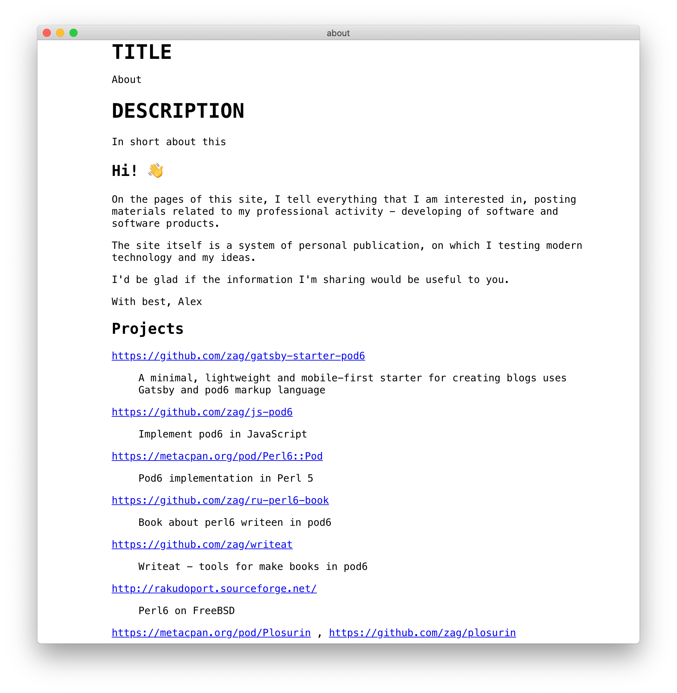

 <h1 align="center">

<br/> 
  Podlite
<br/>
<br/>
</h1>
<h4 align="center">The viewer and editor of pod6 files for Windows, Linux and Mac.</h4>

## Screenshots





## Get Podlite


Download the [latest release](https://github.com/zag/podlite-desktop/releases/latest) of Podlite editor here:

### [✨ Download Podlite ✨](https://github.com/zag/podlite-desktop/releases/latest)


## Features

* Write in pod6 markup language 
* Preview elements (such as headers, images, math, embedded videos, todo lists...) while you type
* Preview mode cmd-/ ( win-/ )
* export to html and pdf
* import from markdown
* make diagrams via =Diagram block
* And more features to come...

## pod6 extensions
### `=Image` - use images or video in posts

Example:

`=Image gatsby-astronaut.png
`

`=Image some-video.mp4
`
### `=Diagram` - use diagrams

To render beautiful graphs, sequence and Gantt diagrams and flowcharts, one can use the `=Diagram` blocks.

```
=begin Diagram 
graph LR
        A-->B
        B-->C
        C-->A
        D-->C
=end Diagram
```


[Open this example in pod6.in](https://pod6.in/#p=%3Dbegin+Diagram+%0Agraph+LR%0A++++++++A--%3EB%0A++++++++B--%3EC%0A++++++++C--%3EA%0A++++++++D--%3EC%0A%3Dend+Diagram)

#### Flowchart

```
=Diagram
graph LR
    A[Square Rect] -- Link text --> B((Circle))
    A --> C(Round Rect)
    B --> D{Rhombus}
    C --> D
```


[Open this example in pod6.in](https://pod6.in/#p=%3Dhead1+Graph%0A%0A%3DDiagram%0Agraph+LR%0A++A--%3EB%0A++B--%3EC%0A++C--%3EA%0A++D--%3EC%0A%0A%3DDiagram%0Agraph+LR%0A++++A%5BSquare+Rect%5D+--+Link+text+--%3E+B%28%28Circle%29%29%0A++++A+--%3E+C%28Round+Rect%29%0A++++B+--%3E+D%7BRhombus%7D%0A++++C+--%3E+D%0A%0A%0A+%0A%0A)

```
=Diagram
graph TD
   A(Coffee machine <br>not working) --> B{Machine has power?}
   B -->|No| H(Plug in and turn on)
   B -->|Yes| C{Out of beans or water?} -->|Yes| G(Refill beans and water)
   C -->|No| D{Filter warning?} -->|Yes| I(Replace or clean filter)
   D -->|No| F(Send for repair)
```


[Open this example in pod6.in](https://pod6.in/#p=%3Dhead1+Flowchart%0A%3DDiagram%0Agraph+TD%0A+++A%28Coffee+machine+%3Cbr%3Enot+working%29+--%3E+B%7BMachine+has+power%3F%7D%0A+++B+--%3E%7CNo%7C+H%28Plug+in+and+turn+on%29%0A+++B+--%3E%7CYes%7C+C%7BOut+of+beans+or+water%3F%7D+--%3E%7CYes%7C+G%28Refill+beans+and+water%29%0A+++C+--%3E%7CNo%7C+D%7BFilter+warning%3F%7D+--%3E%7CYes%7C+I%28Replace+or+clean+filter%29%0A+++D+--%3E%7CNo%7C+F%28Send+for+repair%29)
#### UML sequence diagram

```
=Diagram
sequenceDiagram
    autonumber
    Student->>Admin: Can I enrol this semester?
    loop enrolmentCheck
        Admin->>Admin: Check previous results
    end
    Note right of Admin: Exam results may <br> be delayed
    Admin-->>Student: Enrolment success
    Admin->>Professor: Assign student to tutor
    Professor-->>Admin: Student is assigned
```


[Open this example in pod6.in](https://pod6.in/#p=+%3Dhead2+UML+sequence+diagram%0A%0A%3DDiagram%0AsequenceDiagram%0A++++autonumber%0A++++Student-%3E%3EAdmin%3A+Can+I+enrol+this+semester%3F%0A++++loop+enrolmentCheck%0A++++++++Admin-%3E%3EAdmin%3A+Check+previous+results%0A++++end%0A++++Note+right+of+Admin%3A+Exam+results+may+%3Cbr%3E+be+delayed%0A++++Admin--%3E%3EStudent%3A+Enrolment+success%0A++++Admin-%3E%3EProfessor%3A+Assign+student+to+tutor%0A++++Professor--%3E%3EAdmin%3A+Student+is+assigned)


#### UML class diagram


```
=Diagram
classDiagram
   Person <|-- Student
   Person <|-- Professor
   Person : +String name
   Person : +String phoneNumber
   Person : +String emailAddress
   Person: +purchaseParkingPass()
   Address "1" <-- "0..1" Person:lives at
   class Student{
      +int studentNumber
      +int averageMark
      +isEligibleToEnrol()
      +getSeminarsTaken()
    }
    class Professor{
      +int salary
    }
    class Address{
      +String street
      +String city
      +String state
      +int postalCode
      +String country
      -validate()
      +outputAsLabel()  
    }
```


[Open this example in pod6.in](https://pod6.in/#p=%3Dhead1+%0AUML+class+diagram%0A%0A%3DDiagram%0AclassDiagram%0A+++Person+%3C%7C--+Student%0A+++Person+%3C%7C--+Professor%0A+++Person+%3A+%2BString+name%0A+++Person+%3A+%2BString+phoneNumber%0A+++Person+%3A+%2BString+emailAddress%0A+++Person%3A+%2BpurchaseParkingPass%28%29%0A+++Address+%221%22+%3C--+%220..1%22+Person%3Alives+at%0A+++class+Student%7B%0A++++++%2Bint+studentNumber%0A++++++%2Bint+averageMark%0A++++++%2BisEligibleToEnrol%28%29%0A++++++%2BgetSeminarsTaken%28%29%0A++++%7D%0A++++class+Professor%7B%0A++++++%2Bint+salary%0A++++%7D%0A++++class+Address%7B%0A++++++%2BString+street%0A++++++%2BString+city%0A++++++%2BString+state%0A++++++%2Bint+postalCode%0A++++++%2BString+country%0A++++++-validate%28%29%0A++++++%2BoutputAsLabel%28%29++%0A++++%7D)

#### Gantt diagram
```
 =Diagram
 gantt
 title Example Gantt diagram
    dateFormat  YYYY-MM-DD
    section Team 1
    Research & requirements :done, a1, 2021-04-08, 2021-04-10
    Review & documentation : after a1, 20d
    section Team 2
    Implementation      :crit, active, 2021-04-25  , 20d
    Testing      :crit, 20d
```


[Open this example in pod6.in](https://pod6.in/#p=+%0A+%3Dhead2+Gant%0A+%0A+%3DDiagram%0A+gantt%0A+title+Example+Gantt+diagram%0A++++dateFormat++YYYY-MM-DD%0A++++section+Team+1%0A++++Research+%26+requirements+%3Adone%2C+a1%2C+2021-04-08%2C+2021-04-10%0A++++Review+%26+documentation+%3A+after+a1%2C+20d%0A++++section+Team+2%0A++++Implementation++++++%3Acrit%2C+active%2C+2021-04-25++%2C+20d%0A++++Testing++++++%3Acrit%2C+20d)


Diagrams are created by linking text labels using arrow connectors. You can choose different shapes, add labels to connectors, and style connectors and shapes.
`=Diagram` uses Mermaid diagramming and charting tool.
[Mermaid documentation for the complete syntax](https://mermaid-js.github.io/mermaid/#/)
## Documentation
* [Pod6 - An easy-to-use markup language for documenting Raku modules and programs](https://docs.raku.org/language/pod)
* Specification of pod6: [Synopsis 26](https://github.com/perl6/specs/blob/master/S26-documentation.pod)
* [Create a blog with pod6](https://zahatski.com/2020/5/28/1/create-a-blog-with-pod6)
* Pod6 online editor: [Pod6 to HTML online](https://pod6.in/)

## Contributing

This is an open source program. Feel free to fork and contribute.

In order to keep the match between this documentation and the last release, please contribute and pull requests on the dedicated develop branch.

## linux note


## AUTHOR

Copyright (c) 2020 - 2021 Alexandr Zahatski


## License

Released under a MIT License.